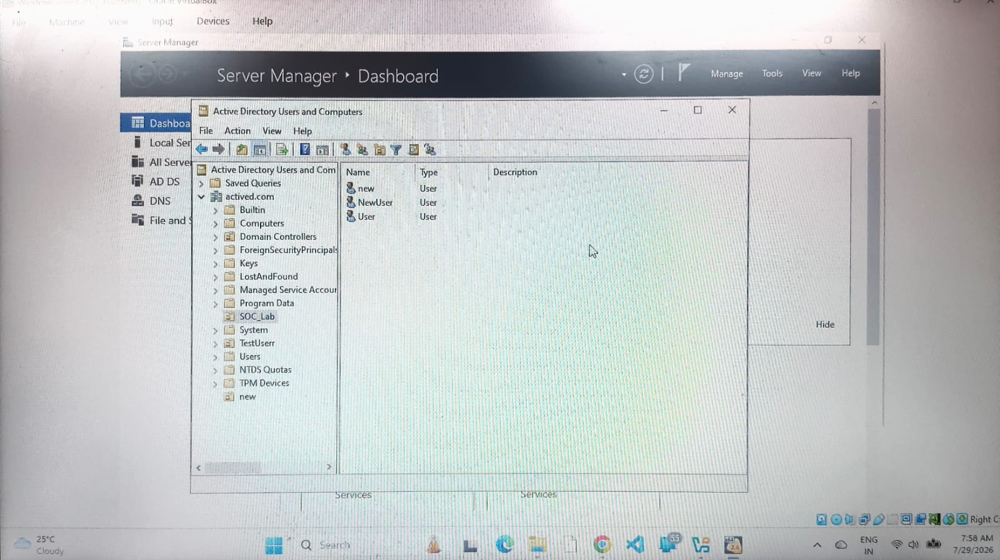
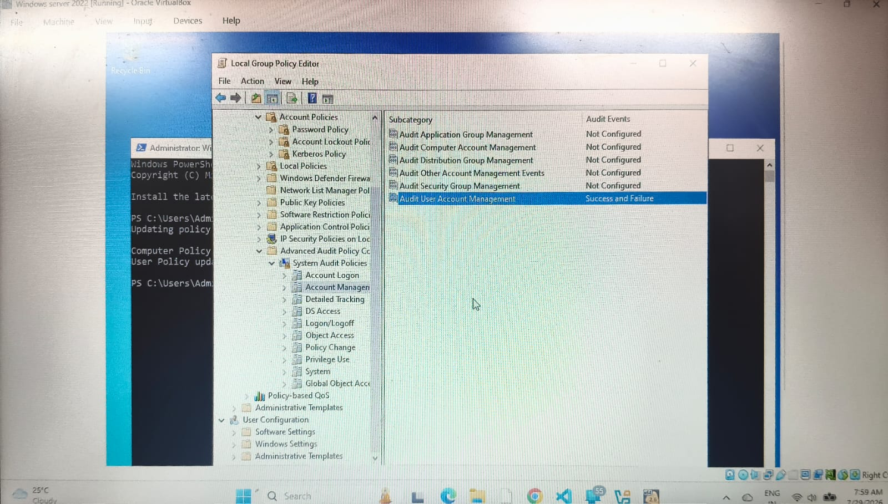

# active-directory-monitoring
A security operations center (SOC) lab demonstrating Wazuh SIEM integration with Active Directory for log monitoring and threat detection.

Project Overview
This project demonstrates the setup of a Security Operations Center (SOC) lab environment. It integrates Active Directory (AD) on Windows Server with Wazuh SIEM to monitor, collect, and analyze security event logs, user management activities, and potential threats in real-time.

Tools & Technologies Used:
SIEM / XDR Solution: Wazuh SIEM
Directory Services: Active Directory (AD), Windows Server 2022
Endpoints: Windows 10, Kali Linux (for security testing)
Frameworks & Concepts: MITRE ATT&CK, Vulnerability Detection, Event ID Analysis

Step-by-Step Implementation & Configuration:
1. Active Directory Setup & User Management
Configured Active Directory Domain Services (actived.com) on Windows Server and created organizational units and user accounts.
Screenshot:

2. Group Policy Object (GPO) Audit Configuration
Enabled advanced audit policies (Audit User Account Management set to Success and Failure) to capture security event logs effectively.
Screenshot:

3. Wazuh Agents Deployment
Connected Windows Server and Windows 10 endpoints as active agents to the Wazuh SIEM server.
Screenshot:
(Yithe tumhi 1000421484_2.png ha screenshot taku sakta)

Security Event Log Analysis (Wazuh Dashboard):
The Wazuh SIEM successfully collected and monitored crucial Windows Security Event IDs:

Event ID 4720 (User Account Created):
Screenshot: (Yithe 1000421479_2.png taku sakta)

Event ID 4625 (Failed Logon Attempt):
Screenshot: (Yithe 1000421480_2.png taku sakta)

Event ID 4624 (Successful Logon):
Screenshot: (Yithe 1000421481_2.png taku sakta)

Threat Intelligence & Vulnerability Detection:
MITRE ATT&CK Integration: Mapped security alerts to tactics and techniques.
Screenshot: (Yithe 1000421485_2.png taku sakta)

Vulnerability Assessment: Scanned connected endpoints for system vulnerabilities and CVEs.
Screenshot: (Yithe 1000421482_2.png taku sakta)

Conclusion
This lab successfully showcases centralized log management, threat detection, and Active Directory auditing using an open-source SIEM tool like Wazuh, mirroring real-world SOC operations.
