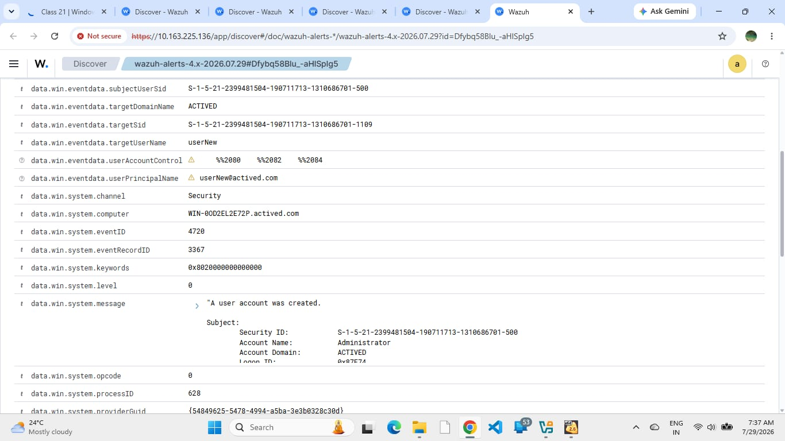
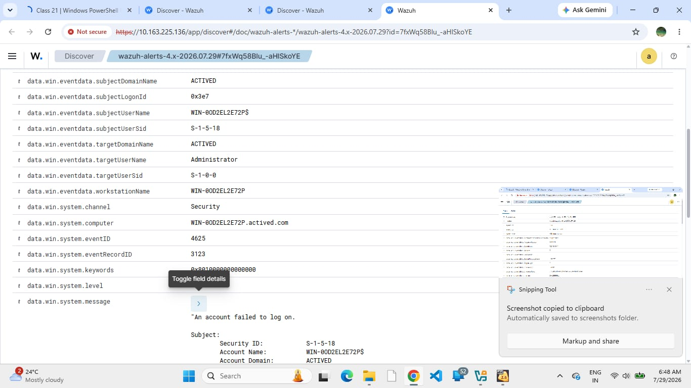
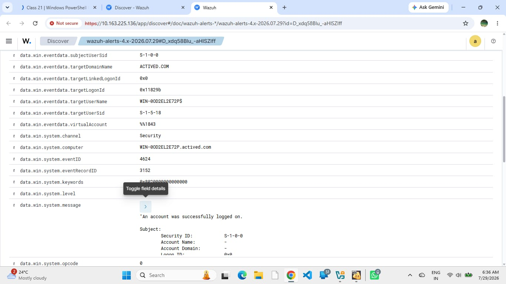
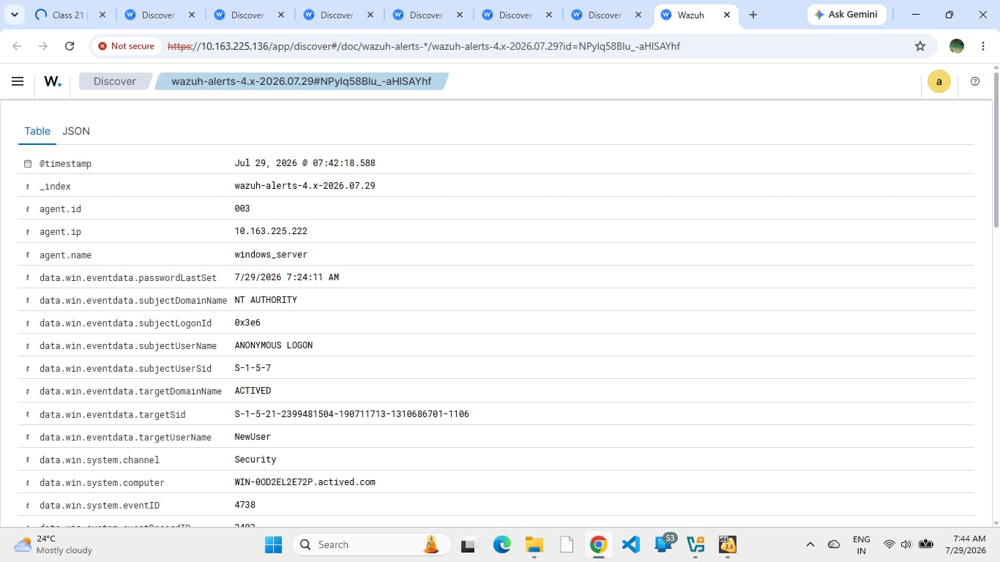
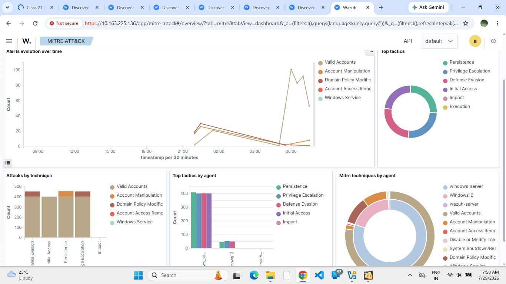
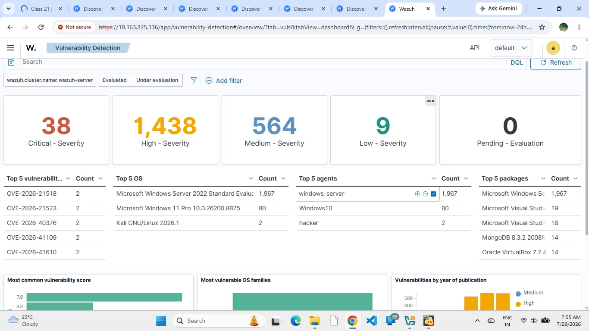

# active-directory-monitoring

A security operations center (SOC) lab demonstrating Wazuh SIEM integration with Active Directory for log monitoring and threat detection.

Project Overview:

This project demonstrates the setup of a Security Operations Center (SOC) lab environment. It integrates Active Directory (AD) on Windows Server with Wazuh SIEM to monitor, collect, and analyze security event logs, user management activities, and potential threats in real-time.

Tools & Technologies Used:

SIEM / XDR Solution: Wazuh SIEM

Directory Services: Active Directory (AD), Windows Server 2022

Endpoints: Windows 10, Kali Linux (for security testing)

Frameworks & Concepts: MITRE ATT&CK, Vulnerability Detection, Event ID Analysis

Step-by-Step Implementation & Configuration:
1. Active Directory Setup & User Management:
   
Configured Active Directory Domain Services (actived.com) on Windows Server and created organizational units and user accounts.
Screenshot:

3. Group Policy Object (GPO) Audit Configuration:
   
Enabled advanced audit policies (Audit User Account Management set to Success and Failure) to capture security event logs effectively.
Screenshot:

3.Log Forwarding & Wazuh Agents Deployment:

Configured Wazuh agents to securely forward Windows security event logs to the central SIEM server, connecting Windows Server and Windows 10 endpoints as active agents to the Wazuh SIEM dashboard.
   Screenshot:

Security Event Log Analysis (Wazuh Dashboard):

The Wazuh SIEM successfully collected and monitored crucial Windows Security Event IDs:

Event ID 4720 (User Account Created):
      Screenshot: 

Event ID 4625 (Failed Logon Attempt):
         Screenshot:

Event ID 4624 (Successful Logon):
         Screenshot: 

Event ID 4738 (User Account Modified):
           Screenshot:

Threat Intelligence & Vulnerability Detection:
  
  MITRE ATT&CK Integration: 
  Mapped security alerts to tactics and techniques.
    Screenshot: 

Vulnerability Assessment: 
Scanned connected endpoints for system vulnerabilities, misconfigurations, and CVEs.
  Screenshot:

Conclusion:

This lab successfully showcases centralized log management, threat detection, and Active Directory auditing using an open-source SIEM tool like Wazuh, mirroring real-world SOC operations.
